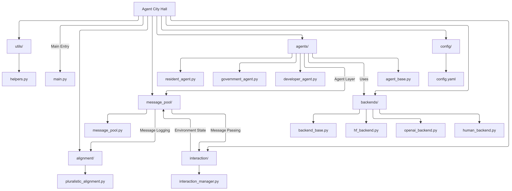

# Agent City Hall

Agent City Hall serves as the human layer for existing city simulations, introducing social alignment to the model. This framework integrates diverse agents—such as government, developers, and residents—to enable social dynamics modeling and policy evaluation, enriching urban planning simulations with a focus on human-centric perspectives.

## Project Structure

- **main.py**: Main script to initialize and run the simulation.
- **config/**: Contains configuration files, such as `config.yaml`, for setting parameters.
- **agents/**: Defines different types of agents involved in the simulation.
  - `agent_base.py`: Base class for agents.
  - `government_agent.py`: Government agent class.
  - `developer_agent.py`: Developer agent class.
  - `resident_agent.py`: Resident agent class.
- **interaction/**: Manages interactions among agents.
- **message_pool/**: Manages the message exchange between agents.
- **alignment/**: Contains the pluralistic alignment module, responsible for aligning agent objectives.
- **backends/**: Contains different intelligence backend implementations.
- **utils/**: Utility functions and helpers for logging and configuration loading.



## Getting Started

## Getting Started

1. **Install Dependencies**: Make sure to install the required packages.
   ```bash
   pip install -r requirements.txt
   ```

2. **Configure Settings**: Modify `config/config.yaml` to adjust simulation parameters.

3. **Run the Simulation**:
   ```bash
   python main.py
   ```

## Requirements

The project dependencies are listed in `requirements.txt`.

## License

This project is licensed under the MIT License.