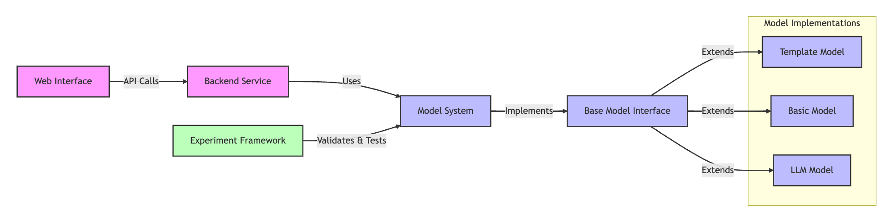

# Agent City Hall

Simulation framework for evaluating zoning proposals through agent-based modeling.

## Project Structure

```
src/
├── backend/           # Flask-based API service
├── frontend/         # React-based web interface
│
├── models/           # Simulation models
│   └── ...          # Different model implementations
│
└── experiment/       # Evaluation framework
    ├── eval/        # Test data and metrics
    ├── log/         # Experiment results
    └── scripts/     # Experiment runners
```

## Module Relationships



## Quick Start

1. Install dependencies:
```bash
pip install -e .
cd src/frontend && npm install
```

2. Set up OpenAI API key:
```bash
echo "OPENAI_API_KEY=your-key-here" > .env
```

## Project Modules

- `experiment/`: Testing and validation framework
- `models/`: Opinion simulation model implementations
- `frontend/`: React-based web interface for proposal visualization
- `backend/`: RESTful API service for proposal evaluation
  
For detailed documentation, please refer to the README in each module directory.

## License

MIT
