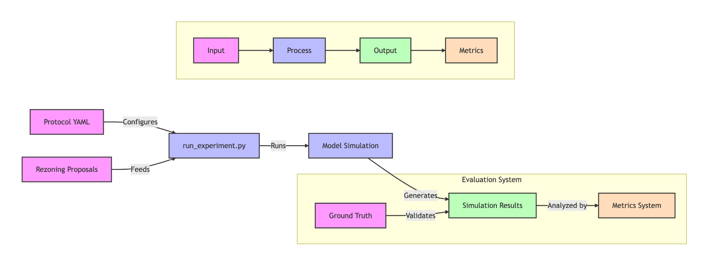

# Experiment Module

This directory contains the experiment framework for evaluating agent opinions on zoning proposals.

## Data Flow



## Directory Structure

```
experiment/
├── protocols/           # Experiment protocols
│   └── sample_protocol.yaml
├── eval/
│   ├── data/
│   │   ├── inputs/     # Input proposals
│   │   └── ground_truth/
│   │       ├── sample_group_distribution_gt.json
│   │       └── sample_individual_gt.json
│   └── utils/          # Evaluation utilities
│       ├── data_manager.py   # Data I/O and management
│       ├── data_models.py    # Data structures
│       └── metrics.py        # Metrics calculation
├── log/                # Experiment results
└── scripts/            # Experiment runners
```

## Running Experiments

To run an experiment:

```bash
python scripts/run_experiment.py --protocol protocols/sample_protocol.yaml
```

## Protocol Format

Protocols define experiment parameters in YAML format:

```yaml
name: "experiment_name"
description: "Experiment description"

model: "stupid"    # which model to use for simulation
population: 2      # number of agents to simulate

input:
  proposals:       # list of input proposal files
    - "sample_proposal.json"

region: "san_francisco"    # target region

evaluation:
  metrics:
    - type: "group_distribution"
      ground_truth: "sample_group_distribution_gt.json"
    - type: "individual_match"
      ground_truth: "sample_individual_gt.json"
```

## Output Structure

Each experiment run creates a directory under `log/` with:

- `protocol.yaml`: Copy of the experiment protocol
- `experiment_metadata.json`: Runtime information
- For each proposal:
  - `{id}_input.json`: Input proposal
  - `{id}_output.json`: Simulation results
  - `{id}_metrics.json`: Evaluation metrics (if ground truth exists) 